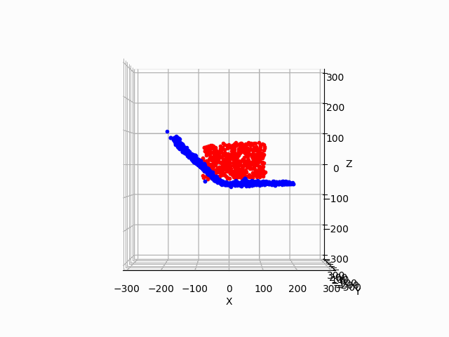

# SOCS
Pytorch implementation of SOCS: Semantically-aware Object Coordinate Space for Category-Level 6D Object Pose Estimation under Large Shape Variations
([link](https://arxiv.org/abs/2303.10346))

visualization of coordinate in NOCS:

visualization of coordinate in SOCS:

pose optimization by SOCS
